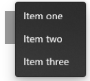

## Picker Flyout Repro

This repository is a minimum repro of the issue outlined [here](https://github.com/microsoft/react-native-windows/issues/3842). I created this app by following the Getting Started steps in the react-native-windows project, and then placed Pickers in each of the 4 corners of the app. I expect the placement of the Picker's Flyout to be the same for all 4 regardless of their placement on the page, but that is not the case:

Top Left:

Top Right:

Bottom Left:

Bottom Right:

Expected behavior from XAML Controls Gallery:

In the expected case, the Flyout is centered horizontally and anchored directly below the Picker regardless of its placement in the app window.